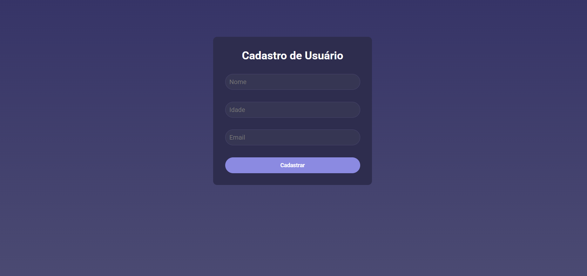

# 🧑‍💻 Cadastro de Usuários – Frontend

Interface web da aplicação de cadastro de usuários. Desenvolvida com React e conectada à API para operações de CRUD (criação, leitura, atualização e exclusão) de usuários.

---

## Preview 🖼️



---

## Deploy / Link 🔗

🌐 [Acesse o frontend online](https://cadastro-usuarios-rosy.vercel.app)

---

## 🚀 Tecnologias Utilizadas

- React
- Vite
- CSS / TailwindCSS
- React Router
- fetch / axios para requisições
- Controle de estado com hooks (useState, useEffect etc.)  

## 📦 Funcionalidades

- Formulário de cadastro de usuários  
- Listagem dos usuários cadastrados  
- Edição de dados dos usuários  
- Remoção de usuários  
- Validações de formulário (campos obrigatórios, formatos)  
- Comunicação com a API via endpoints REST  
- Tratamento de erros e feedback visual  
- Layout responsivo para devices diversos  

---

## 🚀 Como Rodar Localmente

```bash
# Clone o repositório
git clone https://github.com/nandosabino/cadastro-usuarios.git

cd cadastro-usuarios

# Instale dependências
npm install

# Rode em modo de desenvolvimento
npm run dev
